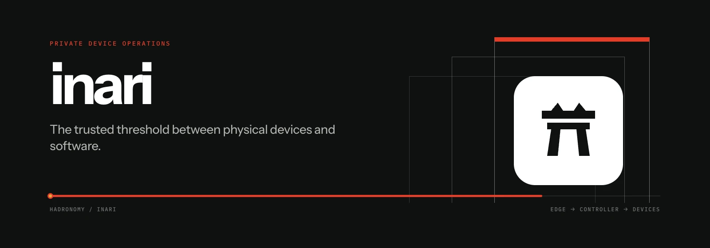

<div align="center">
  
  <p></p>
  <a href="https://github.com/hadronomy/inari/blob/main/LICENSE">
    <picture>
      <source media="(prefers-color-scheme: dark)" srcset="https://shieldcn.dev/github/license/hadronomy/inari.svg?mode=dark" />
      
    </picture>
  </a>
  <a href="https://github.com/hadronomy/inari/stargazers">
    <picture>
      <source media="(prefers-color-scheme: dark)" srcset="https://shieldcn.dev/github/stars/hadronomy/inari.svg?mode=dark" />
      
    </picture>
  </a>
  <p></p>
  <p align="center">
    <strong>A private control plane for the devices your software still has to touch.</strong><br />
    <sub>Printers, scales, scanners, and edge hardware—local-first, secure, and observable.</sub>
  </p>
  <p></p>
  <a href="#what-inari-does">Overview</a> •
  <a href="#development">Development</a> •
  <a href=".github/CONTRIBUTING.md">Contributing</a> •
  <a href="#deployment">Deployment</a> •
  <a href="#documentation">Documentation</a>
  <hr />
</div>

> [!CAUTION]
> Inari is alpha software. Expect protocol, configuration, and storage changes
> before the first stable release.

## What Inari does

Inari connects the ordinary hardware around a business—receipt printers,
office printers, scales, scanners, and other USB or network devices—to the
software that needs it. Odoo and similar systems work with a stable local API;
the edge agent deals with drivers, queues, retries, and the awkward realities of
hardware.

The agent runs beside the devices and keeps working through controller or
network interruptions. Device Center gives the person at that machine a tray,
setup assistant, and local device view. Organizations that need fleet-wide
operation can add the Rust controller for enrollment, policy, audit, and remote
work over Zenoh.

```text
Odoo / local application
        │
        ▼
Inari Agent ─── drivers ─── printers, scales, scanners
    │
    ├── Device Center on the local desktop
    │
    └── HTTPS enrollment + Zenoh ─── Inari Controller
                                         │
                                         ├── PostgreSQL
                                         ├── OIDC
                                         └── step-ca
```

The agent is the service. Device Center is a user-session client. Managed mode
extends the local runtime; it does not replace it.

## Development

The repository is a Rust, Python, and Bun workspace. Install the tool versions
declared in [`mise.toml`](mise.toml), add the browser target, and synchronize
the workspace:

```sh
mise install
rustup target add wasm32-unknown-unknown
cargo install cargo-leptos --locked
mise exec -- just sync
```

Run the controller and hydrated Leptos interface with:

```sh
cargo leptos watch
```

The edge components have focused guides:

- [Agent development](packages/agent/README.md)
- [Device Center development](crates/inari-device-center/README.md)

Before submitting a change, run:

```sh
mise exec -- just check
```

That is the repository-wide gate for Rust, Python, the web build, release tools,
and deployment manifests. Rust compilation is always validated with Clippy.

## Interfaces

The controller keeps browser pages and APIs under different owners:

- `/api/inari/v1` is the typed JSON API for Inari resources;
- `/api/zenoh/v1/{selector}` is the optional Zenoh HTTP compatibility surface;
- Leptos serves pages outside `/api` and hydrates them in Rust/WebAssembly.

Unknown API paths return RFC 9457 problem details, never an HTML page. The Zenoh
surface keeps selector semantics intact rather than turning the keyspace into a
second Inari resource API.

## Deployment

The production controller runs as a stateless Axum/Leptos service backed by
externally managed PostgreSQL. The Zenoh router runs separately with stable
network identity. OIDC and step-ca remain organization-owned services.

Build the server and browser assets together:

```sh
cargo leptos build --release
```

Deploy the binary with `target/site` and set `LEPTOS_SITE_ROOT` to that asset
directory. Apply embedded database migrations before rolling application pods:

```sh
inari-server database migrate
inari-server database status
```

The maintained Kubernetes distribution is the Helm chart in
[`deploy/helm/inari`](deploy/helm/inari). A Kustomize-owned alternative lives in
[`deploy/kustomize/inari`](deploy/kustomize/inari). Choose one lifecycle owner
for a given installation.

Windows users install the signed **Inari Device Center** MSIX, which contains
both the tray application and the background agent service. See the
[Windows installation guide](docs/windows.md) before trusting the private alpha
signing hierarchy.

## Documentation

- [Architecture](ARCHITECTURE.md)
- [Contributing](.github/CONTRIBUTING.md)
- [Roadmap](ROADMAP.md)
- [Kubernetes operations](docs/kubernetes.md)
- [Windows installation](docs/windows.md)
- [Release process](docs/releases.md)
- [Controller database](docs/controller_database.md)
- [Managed gateway protocol](docs/gateway_protocol.md)
- [Managed deployment](docs/managed_gateway_stacks.md)
- [Zenoh HTTP compatibility](docs/zenoh_rest_axum.md)
- [Odoo print compatibility](docs/odoo-print-behaviours.md)
- [Brand guide](docs/brand.md)

## License

Inari is available under the [MIT License](LICENSE).
