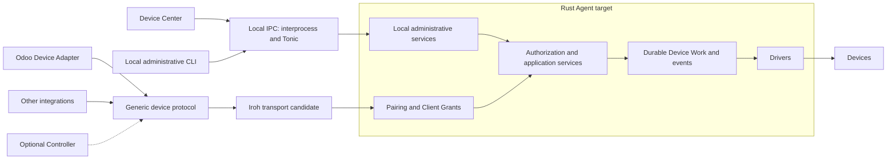

# Connectivity redesign

**Status:** Target design for future implementation. Runtime behavior is unchanged.
**Updated:** 2026-10-08.

This is the canonical reference for the connectivity redesign. It records the
selected local stack and separates it from remaining technology recommendations.

| Document | Use |
| --- | --- |
| [Target glossary](CONTEXT.md) | Generic terms and their boundaries |
| This reference | Requirements, design, technology choices, and open decisions |
| [Implementation guide](implementation.md) | Ordered work with completion criteria |
| [Rust craft standard](rust-craft.md) | API, deep module, data layout, authoring, and stage gates |
| [Research index](#research-index) | Primary sources and alternative designs |

## Authority and status

**Required** marks user requirements and preserved safety rules.
**Selected** marks a technology the user chose for implementation.
**Recommended** marks the baseline to validate before adoption.
**Optional** marks a feature outside the default product.
**Open** marks a decision with a required result in the implementation guide.

The requirements in this reference govern the target redesign. Earlier research
contains the evidence and historical alternatives. Its rollout orders and
candidate lists do not create additional implementation requirements.

[Current architecture](../../ARCHITECTURE.md) describes existing behavior.
Current managed HTTPS, Zenoh, and certificate rules apply to that implementation.
They do not make those services prerequisites for the target default.

The research inspected two different revisions:

- Checkout: `ff7f3132274b415b533e5f7013d487de5bb242d4`.
- Local `main`: `a1c04f5b94e05aaab8f25d77a01f7372e0514e20`.

The checkout has no root `CONTEXT.md`. The inspected `main` glossary defines
several terms through Odoo. The [target glossary](CONTEXT.md) explicitly
generalizes those terms. It does not change the current protocol.

## Required product behavior

- The default installation operates without a Controller.
- Agent owns Devices, authorization, durable Device Work, and execution evidence.
- Device Center remains a user-session application. Agent remains the service.
- Device Center uses protected local IPC, including across different OS accounts.
- Local IPC uses interprocess with Tokio and Tonic/Protobuf for typed calls and event streams.
- Rust is the target Agent language. Python remains an integration language.
- Several independent integrations use the same generic device contract concurrently.
- Core contracts and permissions contain no required Odoo business fields.
- Installation and pairing use automatic discovery or explicit invitations, with minimal manual input.
- Saved identity survives restart and network changes. Reconnect does not create another Client Pairing.
- Physical execution keeps precise Output Evidence and Outcome Unknown behavior.
- Each implementation stage must pass the [Rust craft gate](rust-craft.md#stage-completion-gate) before the next stage starts.

The default needs no PostgreSQL, OIDC, step-ca, Zenoh Router, or fleet service.
Remote reachability still needs relay infrastructure where direct connections
fail. A relay provides connectivity, not Device authority or work storage.

## Component boundaries

| Component | Owns | Boundary |
| --- | --- | --- |
| Agent | Identity, grants, Devices, queues, leases, state, events, local audit | Final authority for Device access |
| Device Center | Approval UI, Device Health, diagnostics, service controls | No direct hardware execution |
| SDK | Client identity, connection lifecycle, typed requests, reconciliation | Library inside the Client, not another service |
| Device Adapter | Business workflow, rendering, external identifiers | Converts application intent into generic Device Work |
| Transport | Connection establishment, authenticated transport identity, byte delivery | No application permission decisions |
| Relay and address lookup | Reachability and forwarding | No grants, Device Work queue, or execution authority |
| Optional Controller | Explicitly delegated fleet policy and coordination | Cannot become a prerequisite for local operation |

Local administration and device operations are distinct method surfaces.
Remote Clients cannot acquire local administrative methods through a device
grant. Both surfaces call the same authorization and runtime services.

Generated transport models stay behind the client boundary. Drivers and runtime
services use domain types. Dependency injection stays at the composition root.

## Technology baseline

| Area | Status | Choice and reason |
| --- | --- | --- |
| Local byte transport | Selected | `interprocess` with Tokio: Unix sockets and Windows named pipes through one API |
| Local RPC | Selected | Tonic, Protobuf, and prost: typed methods, errors, and event streams |
| Network transport | Recommended | Native Rust Iroh: peer identity, direct paths, and relay paths |
| Pairing authority | Required | Agent-owned Client Pairings and bounded Client Grants |
| Identity protection | Recommended | Existing protected secret stores and maintained cryptographic libraries |
| Durable state | Recommended | Agent-owned SQLite, with one migration owner at each implementation stage |
| Local discovery | Optional | mDNS/DNS-SD for native Clients, with `mdns-sd` as the Rust candidate |
| First-pairing UI | Recommended | App link or QR invitation with explicit local approval |
| Local diagnostics | Recommended | Structured tracing and a content-free Diagnostics Bundle |

The local stack is selected. Implementation includes security and lifecycle
validation, without a transport comparison or adoption experiment.

Tonic encodes HTTP/2 inside local IPC. It requires no local TCP port or
certificate enrollment. Inari still needs a Windows connector, connection
identity, message limits, and administrative authorization.

Protobuf is the recommended authoritative domain wire schema for the Rust
redesign. Local administration can have separate methods in that schema.
An Iroh protocol can reuse device messages without becoming a gRPC endpoint.
The Iroh framing and protocol selection remain an open design detail.

Existing OpenAPI, Pydantic, FastAPI, and Progenitor describe the current HTTP
boundary. They are implementation evidence, not a second target domain schema.
Any retained HTTP interface needs an explicit owner and generated mappings.

The current Python Agent does not force the target core through FFI. Official
Iroh Python bindings serve Python Clients. PyO3 and Maturin are optional only
for an identified shared native module.

## Protected local IPC

Device Center connects automatically under an authorized OS account.
Installation establishes the local access policy. External QR pairing does not
apply to this connection. Agent Administrator rights govern administrative methods.

| OS | Required transport and admission behavior |
| --- | --- |
| Windows | Named pipe with an explicit DACL, remote-client rejection, and first-instance protection; connected-client token authorization |
| Linux | Filesystem Unix socket in an Agent-owned directory; user/group policy and kernel peer credentials |
| macOS | Filesystem Unix socket in a protected directory; effective peer user identity using macOS semantics |

Both peers establish identity. A socket path or pipe name alone does not prove
Agent identity. A Windows PID alone does not prove a client's security principal.
Windows token capture and impersonation reversion stay in one synchronous scope.
Impersonation never remains active across a Tokio `.await`.

The inspected `interprocess` 2.4.4 source supports custom Windows descriptors,
remote rejection, first-instance protection, and native handle access.
The [local IPC audit](../local-ipc-alternatives-research.md#interprocess-source-audit)
contains the pinned source and OS references. Default Windows pipe permissions
are insufficient for this design.

OS credentials establish an account boundary. They do not distinguish every
application under that account. The exact account policy and any additional
application identity requirement need definition during local IPC implementation.

Connection queues, message sizes, in-flight calls, and subscriber buffers are
bounded. A slow subscriber receives an explicit recovery outcome. Its queue
cannot block Device execution or consume unlimited memory.

## Generic device contract

The contract supports these operation families:

| Family | Required behavior |
| --- | --- |
| Identification | Agent identity, Contract Major, readiness, permitted Devices |
| Capabilities | Device Capabilities, Driver Profile requirements, explicit negotiation |
| Device Work | Client-scoped Idempotency Key, bounds, deadline, durable acceptance, typed rejection |
| State | Authorized execution state and Output Evidence |
| Events | Filtered subscriptions, sequence identity, gaps, snapshot or replay recovery |
| Cancellation | Eligibility and authoritative outcome, independent of RPC cancellation |
| Access | Pairing Request, Client Pairing, Client Grant expiry and revocation |

Exact method names, enums, limits, and framing belong in the wire specification
created during implementation. This reference does not invent a completed API.

RPC deadlines bound a caller's wait. Execution deadlines bound when Agent can
start Device I/O. Expiry and cancellation semantics remain explicit at both boundaries.

Odoo database, company, POS configuration, order, and report fields remain in
the Odoo Device Adapter. Optional external references are opaque to Agent
authorization. A display name or external identifier cannot grant access.

Concurrent integrations have independent grants, content access, event filters,
resource limits, and execution records. Idempotency Keys are scoped to the
approved Client identity. Repeated keys with different work are rejected.

Shared Devices use Agent-owned scheduling. Exclusive Devices use Agent-owned
leases. A revoked integration cannot cancel, observe, or starve another
integration without an explicit permission.

## Pairing, identity, and revocation

Iroh authenticates the connection peer. Pairing is Inari's association and
approval workflow. It can run over a restricted Iroh protocol without another
mandatory pairing service.

The Agent keeps a persistent transport key and a protected application identity.
A Client keeps a durable identity. Their association survives reconnect.
An Endpoint ID or Iroh ticket provides addressing, not a Client Grant.

The preferred model maps a durable application Client identity to its approved
transport identity. Key binding and rotation need a wire-level proof through
maintained libraries. Application identity and transport identity must not
silently become interchangeable during reconnect or key replacement.

### First pairing

| Stage | Required invariant |
| --- | --- |
| Invitation | Agent identity, endpoint hints, expiry, and an unpredictable pairing nonce; no private key or device permission |
| Request | Client proves its proposed identity and requests bounded access |
| Review | Authorized local person sees the Agent, Client fingerprint, requested Devices, permissions, and expiry |
| Approval | Agent persists the exact approved association and grants, then consumes the request atomically |
| Decline or expiry | Request grants no access and cannot be reused |

Pending requests are bounded and short-lived. Unknown peers reach only the
restricted pairing surface during an active pairing window. Normal Device Work
requires an approved Client Grant. Invitation possession alone does not approve it.

App names and discovery results are untrusted labels. Proof binds the request
to the Client key and exact Agent. A comparison code establishes that binding
when the initial channel does not establish Agent identity.

The browser path enforces its origin policy in addition to key identity.
An application-supplied origin string is not independent proof of that origin.
Delegated issuers can narrow Agent-approved access only under an explicit policy.
No Odoo assertion issuer or OIDC service is mandatory.

### Saved access and lifecycle

Client Pairing has a saved association with an active or revoked state.
Client Grants have independent scope, expiry, and revocation. A paired Client
with no valid grants receives no Device access.

Revocation rejects further Device Work and closes affected subscriptions and
sessions. It preserves other Clients and durable execution evidence. Work
already accepted follows the runtime's cancellation and safety rules.

A network change triggers address refresh and reconnect. Lost or replaced
identity requires explicit recovery or new pairing. Restoring an old key or
database must not silently restore revoked authority.

Remote revocation reaches an unreachable Agent only after connectivity returns.
Expiry bounds offline permission lifetime. Relay reachability does not change
this authority rule.

## Pairing experience and connection states

| Situation | Preferred user flow |
| --- | --- |
| Installed Device Center | Open the application; authorized local IPC connects automatically |
| Integration on the Agent Host | Select Connect Inari; an app link opens a bounded Pairing Request for approval |
| Nearby native Client | Select a discovered Agent or scan its QR invitation; approve access |
| Remote or headless Client | Import an invitation; approve locally through Device Center or an authenticated CLI |
| Previously paired Client | Use saved identity; reconnect and reconcile automatically |

Ordinary users enter no port, Agent IP, certificate, Odoo company, or Controller
account. Approval is one deliberate access decision per Client association.
Permission renewal and identity recovery remain explicit operations.

| UI state | Meaning and recovery |
| --- | --- |
| Starting | Agent exists but is not ready; wait for readiness |
| Ready | Authenticated connection and compatible contract are available |
| Access required | New pairing, expired permission, or denied local access needs an explicit action |
| Reconnecting | Saved identity remains valid; retry connection with bounded backoff |
| Agent unavailable | Connection attempts cannot reach Agent; show local service or network recovery |
| Incompatible | Contract negotiation failed; show the required software action |
| Outcome Unknown | Physical completion remains uncertain; reconcile or request an explicit recovery decision |

Transport failure, Device Health, and Device Work outcome are separate states.
The UI does not label startup as failure or relay use as an access error.
Each blocked state identifies one useful next action and retains diagnostics.

## Remote reachability and browser support

Native Iroh Clients use direct paths when available and relays when required.
Production uses configured managed or self-hosted relays. Public relay policy
is not a production availability contract.

Browser Iroh builds use a relay under the documented browser restrictions.
A browser cannot open Agent IPC or browse mDNS directly. A complete browser
SDK needs packaging, persistent identity, grant handling, and reconnect behavior.

**Open:** choose and validate the shipped browser path before network adoption.
Iroh/WASM through a production relay is the preferred trial. A local HTTPS
interface or native bridge is an alternative with explicit trust and packaging
cost. Offline browser operation is not a proven property of the Iroh trial.

mDNS/DNS-SD is optional native discovery. Records contain public identity and
capability hints only. Discovery does not grant access. Address lookup refreshes
endpoint hints without changing the saved trusted Agent identity.

If Agent cannot accept work, the integration retains it or reports unavailable
delivery. A relay does not become a hidden store-and-forward Controller.

## Durability and physical safety

Agent acceptance is durable before a successful acceptance response. A
transport acknowledgement, document transfer, or RPC response does not prove
physical completion.

Lost responses use the same Idempotency Key and Job Reconciliation. Reconnect
does not request another physical output. RPC deadline or cancellation does
not prove that Device I/O stopped. Outcome Unknown remains distinct from Failed.

Agent Boot Identity distinguishes event sequences from separate runtime starts.
Durable state supports authorized snapshot or replay recovery. Ephemeral Device
events use explicit gap behavior and never fabricate missed readings.

Protected keys, grants, revocation, work records, and migration ownership
survive restart. The implementation defines backup and restore behavior before
cutover. Alembic owns current Python database changes. A Rust migration owner
requires an explicit handover of that same database.

## Protected state and diagnostics

| State | Owner and handling |
| --- | --- |
| Agent application and transport private keys | Agent account's protected secret store; explicit key roles and versions |
| Client private key | Client's protected persistent storage; browser storage follows the selected browser trust model |
| Client Pairings and Client Grants | Agent database with scope, expiry, revocation, and approved transport binding |
| Pending Pairing Requests | Bounded nonce records with expiry and consumed state; default invalidates pending requests on restart |
| Device Work and event recovery | Durable Agent state with Client ownership and authoritative execution evidence |
| Endpoint hints and connection details | Public metadata, separate from authorization and private keys |

An OS keyring is one protected-store implementation. A system Agent cannot
depend on a logged-in desktop's credential service. Validate unattended access
under the actual service account before choosing the backend.

Diagnostics Bundle fields include Agent identity, Client fingerprint, Contract
Major, transport, direct or relay path, readiness, and recent failure reasons.
They include Agent Boot Identity and event recovery state where relevant.
Private keys, pairing nonces, bearer credentials, and Device Work content are excluded.

Structured local tracing works without an OpenTelemetry collector. Normal users
see useful recovery actions. Transport and identity detail belongs in support
views instead of mandatory setup fields.

## Optional technologies and exclusions

| Technology | Admission condition |
| --- | --- |
| Zenoh | Retain only for a defined optional managed or data feature with its own lifecycle |
| iceoryx2 or Zenoh SHM | Add only for a measured large-data need and a validated secure memory boundary |
| D-Bus/zbus, XPC, ncalrpc | Add only for a required platform capability that portable local IPC cannot meet |
| Tailcat | Network alternative if Iroh fails a required scenario; validate persistent multi-client use and Go packaging |
| Magic Wormhole | Optional remote short-code bootstrap if QR or invitation links do not meet the workflow |
| Iroh Blobs | Optional large-document transfer after version, binding, access, and retention validation |
| TUF/tough | Optional updater trust where native package updates do not meet release requirements |
| OpenTelemetry | Optional export after local Diagnostics Bundles work without a collector |

These technologies are not an installation checklist. Shared-memory payloads
need safe layouts; ordinary pointer-bearing Rust objects do not satisfy that
requirement. The researched iceoryx2 cross-user limitation excludes its current
development-permission workaround from production.

Direct Tokio, tarpc, Cap’n Proto RPC, and NNG remain research background.
They are not alternatives to implement or compare in this plan. Local transport
and RPC use the selected interprocess and Tonic/Protobuf stack.

`ipc-channel` is unsuitable for the default multi-client service design because
of its unbounded channels and one-shot bootstrap. ZeroMQ ranks below the local
stream baseline for the reviewed Windows and Rust IPC support.

OpenTunnel supplies pairing UX ideas, not persistent Inari authority.
OpenZiti, Tailscale/Headscale, NetBird, Cloudflare Tunnel, zrok, and Pangolin add
coordination or connector prerequisites. They do not define the default product.
CRDTs, gossip, and a broker cannot replace Agent execution authority.

## Open decisions and required results

| Decision | Required result | Resolve before |
| --- | --- | --- |
| OS accounts and application identity | Installer policy, both-peer authentication, real-account test evidence | Local IPC completion |
| Wire schema and Iroh framing | One schema owner, method permissions, Contract Major, framing and limits | Network implementation |
| Browser path and offline needs | Working browser flow, recovery behavior, production relay plan | Network adoption |
| Key binding and recovery | Proof format, key roles, rotation and restore rules | Persistent pairing adoption |
| Resource bounds | Measured payloads, finite limits, slow-client outcomes | Release validation |
| Rust storage and Driver cutover | Migration owner, data retention, replacement boundary, working device evidence | Runtime cutover |
| Managed feature disposition | Retain or remove decision for each existing managed surface | Release cutover |
| Production operations | Relay and lookup owners, availability, abuse controls, metadata policy, operating cost | Remote release |

An open decision requires a concrete result, not another candidate list.
Implementation records pinned versions, source dates, and platform results.
Failures require fixes within the selected stack. Replacing a selected technology
requires a new explicit design decision.

## Research index

All evidence dates are 2026-10-08. Revalidate changing library and platform facts
at adoption. The notes contain no Inari performance benchmark or clean-install proof.

| Subject | Evidence and when to read it |
| --- | --- |
| Current friction and Odoo coupling | [Connection research](../connection-simplification-research.md): before the contract inventory |
| Iroh, Tailcat, overlays, relays | [Network alternatives](../inari-connectivity-alternatives-research.md): before remote transport adoption |
| Pairing, discovery, Python, updates, diagnostics | [Supplementary technologies](../pairing-and-sdk-technologies-research.md): before the relevant feature |
| OS local security and selected stack | [Local IPC audit](../local-ipc-alternatives-research.md): before local IPC implementation |
| RPC and messaging alternatives | [RPC candidates](../local-ipc-rpc-candidates-research.md): background rationale for the selected stack |

Primary sources are linked beside the relevant findings in those notes.
The target design and acceptance rules remain in this directory.
