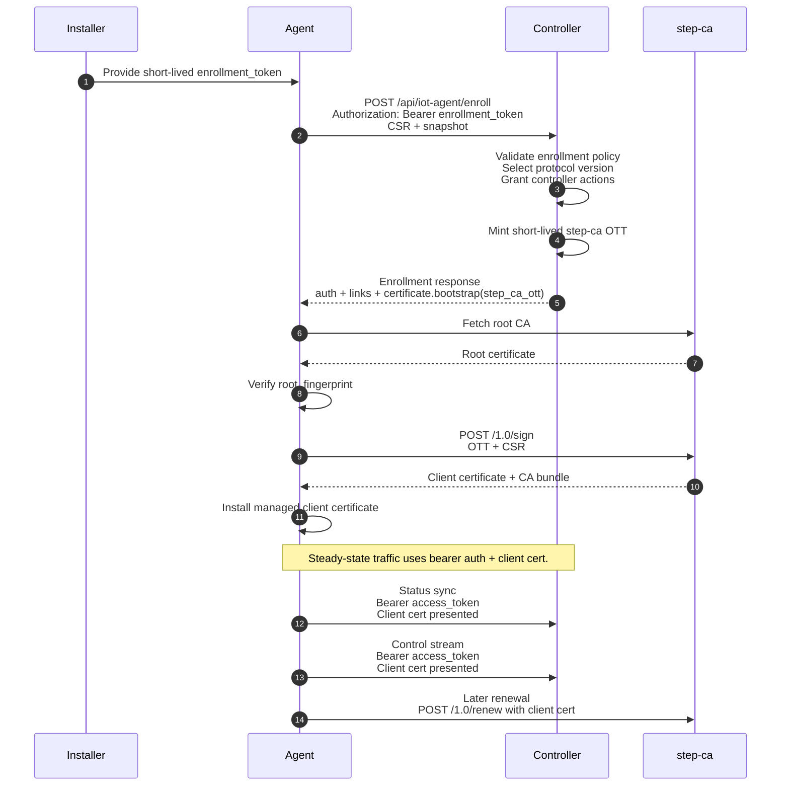

# Gateway Protocol

This document is the protocol draft for the managed-mode controller `<->` agent boundary.

It describes the managed gateway contract with explicit wire semantics. The current codebase now implements the major enrollment, auth, replay, resume, and certificate-lifecycle rules described here; the remaining gaps are mostly future refinements around payload ergonomics and further snapshot slimming.

Use this together with:

- [managed_gateway_stacks.md](./managed_gateway_stacks.md)
- [packages/agent/iot_agent/gateway/protocol.py](../packages/agent/iot_agent/gateway/protocol.py)

## 1. Document Status

- Protocol status: `draft`
- Protocol version: `2026-04-14`
- Transport model:
  - enrollment: outbound `HTTPS`
  - status sync: outbound `HTTPS`
  - control stream: outbound `WSS`
- Agent role: protocol client
- Controller role: protocol server

### 1.1 Draft Meaning

This document remains slightly ahead of the current implementation in a few areas, especially:

- lighter long-lived status documents instead of repeated full snapshots
- `content_ref` style handling for larger print payloads
- a fully standardized controller-side error envelope

Where implementation details are still in motion, treat the code as the immediate source of truth.

## 2. Normative Language

The key words `MUST`, `MUST NOT`, `SHOULD`, `SHOULD NOT`, and `MAY` in this document are to be interpreted as described in [RFC 2119](https://www.rfc-editor.org/rfc/rfc2119).

## 3. Goals

This protocol covers:

- managed enrollment
- short-lived controller-issued `enrollment_token` bootstrap
- controller-managed or external bearer authentication
- controller-issued step-ca OTT bootstrap for client certificates
- optional controller-installed client certificates
- periodic gateway status synchronization
- durable controller-to-agent command delivery
- durable agent-to-controller event delivery
- replay-safe acknowledgement
- reconnect and resume behavior
- protocol version selection

This protocol does not cover:

- local hardware drivers such as Windows spooler, USB, serial, or raw ESC/POS transport
- the agent’s local HTTP API for desktop clients
- multi-controller coordination for one agent identity

## 4. Design Principles

The protocol is built around these principles:

1. The agent connects outward to the controller.
2. The controller is authoritative for enrollment policy.
3. Authentication and certificate bootstrap are separate concerns.
4. Reliability must survive reconnects and duplicate delivery.
5. The wire contract must not depend on the agent’s internal REST payload shapes.
6. Stable identifiers are preferred over user-facing names.

## 5. Terminology

`agent`
: The local `iot-agent` process acting as the managed edge gateway.

`controller`
: The external service coordinating one or more managed agents.

`enrollment_token`
: A short-lived controller-issued bearer credential used only for initial enrollment.

`access_token`
: The bearer token used for normal controller traffic after enrollment.

`refresh_token`
: A controller-issued token used only to refresh a controller-issued `access_token`.

`message_id`
: The transport-level deduplication key for an individual protocol message.

`command_id`
: The idempotency key for a controller command.

`sequence`
: A per-agent controller command cursor used for replay and resume.

## 6. Transport

The agent uses three outbound channels:

- enrollment over `HTTPS`
- status sync over `HTTPS`
- control stream over `WSS`

The controller MUST NOT require inbound agent connections initiated from outside the agent host.

## 7. Trust And Identity

Managed mode uses an outbound trust model:

1. The agent validates the controller TLS certificate.
2. The controller authenticates the agent with bearer credentials, a client certificate, or both.
3. The agent has a persistent logical identity:
   - `agent_id`
   - `key_id`
   - `public_jwk`
   - `csr_pem`
   - optional `certificate_pem`

### 7.1 Identity Binding Rules

The controller SHOULD enforce these bindings:

- `csr_pem` public key MUST match `public_jwk`
- any returned client certificate MUST match the CSR public key
- the agent certificate identity MUST bind to `agent_id`
- if `authorized_sans` are supplied in certificate bootstrap, the issued certificate MUST NOT contain SANs outside that set

## 8. Protocol Version Selection

Version advertisement alone is not enough. The controller MUST explicitly select a protocol version.

### 8.1 Agent Advertisement

The agent advertises:

- `protocol.version`
- `protocol.supported_versions`

### 8.2 Controller Selection

The controller MUST return:

- `selected_protocol_version`

The selected version MUST be one of the versions advertised by the agent.

If there is no mutually supported version:

- the controller MUST reject enrollment
- the agent MUST NOT continue to normal managed operation

### 8.3 Control Stream Revalidation

The controller SHOULD repeat the selected protocol version in `controller.hello`, and the agent SHOULD validate it again on control-stream startup.

## 9. Enrollment

### 9.1 Request

The standard enrollment request is:

```http
POST /api/iot-agent/enroll
Authorization: Bearer <enrollment-token>
Content-Type: application/json
```

The `Authorization` header MAY be omitted only when enrollment authentication is delegated to an external provider such as ZITADEL.

Request body:

```json
{
  "protocol": {
    "version": "2026-04-14",
    "supported_versions": ["2026-04-14"]
  },
  "agent_id": "agt_123",
  "key_id": "kid_123",
  "public_jwk": {
    "kty": "OKP",
    "crv": "Ed25519",
    "alg": "EdDSA",
    "use": "sig",
    "kid": "kid_123",
    "x": "..."
  },
  "certificate_pem": null,
  "csr_pem": "-----BEGIN CERTIFICATE REQUEST-----\n...\n-----END CERTIFICATE REQUEST-----\n",
  "snapshot": {
    "...": "GatewaySnapshotPayload"
  }
}
```

### 9.2 Request Rules

- `agent_id`, `key_id`, `public_jwk`, and `csr_pem` are required
- `certificate_pem` is optional and represents the currently installed client certificate, if any
- the request snapshot is advisory state, not a source of granted permissions
- request-side capabilities SHOULD describe what the agent supports, not what the controller has already granted

### 9.3 Response

The recommended enrollment response shape is:

```json
{
  "selected_protocol_version": "2026-04-14",
  "controller": {
    "name": "Acme IoT Controller",
    "instance_id": "controller-01"
  },
  "auth": {
    "mode": "controller",
    "access_token": "opaque-access-token",
    "refresh_token": "opaque-refresh-token",
    "token_type": "Bearer",
    "expires_at": "2026-04-18T11:00:02Z"
  },
  "links": {
    "refresh": "https://controller.example/api/iot-agent/agents/agt_123/refresh",
    "status": "https://controller.example/api/iot-agent/agents/agt_123/status",
    "events": "wss://controller.example/api/iot-agent/agents/agt_123/events"
  },
  "permissions": {
    "controller_actions": [
      "system:read",
      "devices:read",
      "events:read",
      "jobs:create",
      "jobs:cancel",
      "commands:execute"
    ]
  },
  "certificate": {
    "mode": "step_ca",
    "client_certificate_pem": null,
    "ca_certificate_pem": null,
    "bootstrap": {
      "mode": "step_ca_ott",
      "ca_url": "https://ca.example.com",
      "root_fingerprint": "0123456789abcdef0123456789abcdef0123456789abcdef0123456789abcdef",
      "ott": "step-ca-one-time-token",
      "sign_url": "https://ca.example.com/1.0/sign",
      "renew_url": "https://ca.example.com/1.0/renew",
      "expires_at": "2026-04-18T10:05:02Z",
      "subject": "agt_123",
      "authorized_sans": ["urn:iot-agent:agt_123"],
      "requires_mutual_tls_after_issuance": true
    }
  },
  "enrolled_at": "2026-04-18T10:00:02Z"
}
```

### 9.4 Response Rules

- `selected_protocol_version` is required
- `controller.name` and `controller.instance_id` are optional but strongly recommended
- `auth.mode` is required
- `links.status` and `links.events` are required unless a stable derivation rule has already been agreed
- `permissions.controller_actions` defines what the controller is allowed to ask the agent to do
- `certificate` is optional
- `certificate.bootstrap` is optional

### 9.5 Enrollment Sequence With step-ca Enabled

The recommended managed enrollment flow with step-ca enabled is:



The key transition is that bootstrap enrollment can happen before a client certificate exists, while normal steady-state controller traffic is expected to use the issued client certificate once enrollment has completed successfully. In the recommended production posture, the controller edge then requires mTLS for that steady-state traffic.

## 10. Authentication

The protocol supports two ongoing auth modes.

### 10.1 Controller-Managed Auth

In `controller` mode:

- enrollment uses `Authorization: Bearer <enrollment-token>`
- the controller returns `access_token`
- the controller MAY return `refresh_token`
- subsequent status sync and control-stream requests use `Authorization: Bearer <access_token>`

Recommended response shape:

```json
{
  "auth": {
    "mode": "controller",
    "access_token": "opaque-access-token",
    "refresh_token": "opaque-refresh-token",
    "token_type": "Bearer",
    "expires_at": "2026-04-18T11:00:02Z"
  }
}
```

### 10.2 External Auth Provider

In `zitadel_service_account` mode:

- the controller MAY omit `access_token`
- the agent obtains its own access token from ZITADEL
- the controller still returns enrollment metadata and links

Recommended response shape:

```json
{
  "auth": {
    "mode": "zitadel_service_account",
    "issuer": "https://zitadel.example.com",
    "token_endpoint": "https://zitadel.example.com/oauth/v2/token",
    "audience": "https://controller.example.com"
  }
}
```

### 10.3 Auth Rules

- `enrollment_token` is only for initial enrollment
- `enrollment_token` MUST NOT be used for normal status sync or control-stream traffic after enrollment
- `refresh_token` SHOULD be used only for refresh
- if the controller uses `controller` mode, it MUST provide `access_token`
- if the controller uses `zitadel_service_account` mode, it SHOULD identify that mode explicitly

## 11. Token Refresh

Controller-managed token refresh applies only when `auth.mode == controller`.

Refresh request:

```http
POST <links.refresh>
Authorization: Bearer <refresh-token>
Content-Type: application/json
```

Request body:

```json
{
  "selected_protocol_version": "2026-04-14",
  "agent_id": "agt_123"
}
```

### 11.1 Refresh Rules

- refresh MUST use `refresh_token`, not `access_token`
- refresh response SHOULD reuse the `auth` block shape from enrollment
- if refresh returns `401` or `403`, the agent MUST discard its controller-managed enrollment state and return to an unenrolled state

## 12. Links

The controller SHOULD return a `links` object rather than relying on implicit derivation.

Recommended shape:

```json
{
  "links": {
    "status": "https://controller.example/api/iot-agent/agents/agt_123/status",
    "events": "wss://controller.example/api/iot-agent/agents/agt_123/events",
    "refresh": "https://controller.example/api/iot-agent/agents/agt_123/refresh"
  }
}
```

If link derivation is used, it MUST be stable and documented.

## 13. Certificates

Certificate-related data belongs under a single `certificate` object in the enrollment response.

### 13.1 Certificate Shape

```json
{
  "certificate": {
    "mode": "step_ca",
    "client_certificate_pem": null,
    "ca_certificate_pem": null,
    "bootstrap": {
      "mode": "step_ca_ott",
      "ca_url": "https://ca.example.com",
      "root_fingerprint": "0123456789abcdef0123456789abcdef0123456789abcdef0123456789abcdef",
      "ott": "step-ca-one-time-token",
      "sign_url": "https://ca.example.com/1.0/sign",
      "renew_url": "https://ca.example.com/1.0/renew",
      "expires_at": "2026-04-18T10:05:02Z",
      "subject": "agt_123",
      "authorized_sans": ["urn:iot-agent:agt_123"],
      "requires_mutual_tls_after_issuance": true
    }
  }
}
```

### 13.2 Certificate Mode

`certificate.mode` SHOULD be one of:

- `none`
- `controller`
- `step_ca`

`certificate.bootstrap.mode` SHOULD identify the bootstrap mechanism, for example:

- `step_ca_ott`

### 13.3 step-ca Rules

For `step_ca` mode:

- `root_fingerprint` MUST be `SHA-256` lowercase hexadecimal without separators
- the agent MUST verify the fetched root against that fingerprint
- the agent MUST use its CSR when requesting the first certificate
- the resulting certificate MUST match the CSR public key
- the agent SHOULD renew through `/1.0/renew`
- the OTT SHOULD be short-lived, single-use, and agent-scoped

### 13.4 Bearer And Client Certificate Interaction

If the deployment uses both bearer auth and mTLS:

- the controller SHOULD treat them as two complementary authentication factors
- if the certificate identity and bearer identity disagree, the controller SHOULD reject the connection

### 13.5 Recommended Production Posture

For managed deployments using controller-installed or step-ca-issued client certificates:

- initial enrollment MAY complete with bearer auth before a client certificate exists
- after a managed client certificate has been issued, production deployments SHOULD require mTLS for normal status-sync and control-stream traffic
- deployments following this posture SHOULD expose an explicit bootstrap enrollment URL when the normal controller edge requires client certificates
- an explicit deployment choice to keep mTLS optional after certificate issuance is allowed, but it is not the recommended production default

## 14. Snapshot Model

The agent currently sends a large `GatewaySnapshotPayload`. That remains acceptable for:

- enrollment
- reconnect
- explicit state refresh

For long-lived operation, the protocol SHOULD distinguish:

- `identity`
- `capabilities`
- `status`
- `observability`

The protocol SHOULD evolve toward lighter periodic status refreshes rather than always resending the full snapshot.

## 15. Status Sync

Status sync is a periodic outbound `HTTPS` request from the agent to `links.status`.

```http
POST <links.status>
Authorization: Bearer <access-token>
X-IoT-Agent-Protocol-Version: 2026-04-14
Content-Type: application/json
```

The request body is the current snapshot or a future lighter status document.

### 15.1 Status Sync Response

The controller MAY return a body with controller metadata such as:

- `selected_protocol_version`
- `controller.name`
- `controller.instance_id`

### 15.2 Failure Handling

- `401` or `403`: the agent MUST treat the auth as invalid
- transport or server error: the agent SHOULD enter a retrying state with backoff

## 16. Control Stream

The control stream is an outbound WebSocket connection from the agent to the controller.

```http
GET <links.events>
Authorization: Bearer <access-token>
```

### 16.1 Connection Sequence

1. The agent connects to the controller WebSocket.
2. The agent sends `agent.hello`.
3. The controller sends `controller.hello`.
4. Both sides validate the selected protocol version.
5. Normal command and event traffic begins.

### 16.2 Agent Hello

Recommended shape:

```json
{
  "type": "agent.hello",
  "message_id": "ghello_1",
  "selected_protocol_version": "2026-04-14",
  "supported_versions": ["2026-04-14"],
  "last_applied_controller_sequence": 104,
  "snapshot": { "...GatewaySnapshotPayload..." }
}
```

### 16.3 Controller Hello

Recommended shape:

```json
{
  "type": "controller.hello",
  "message_id": "hello_1",
  "selected_protocol_version": "2026-04-14",
  "resume_from_sequence": 105,
  "controller": {
    "name": "Acme IoT Controller",
    "instance_id": "controller-01"
  }
}
```

### 16.4 Heartbeats

Application-level ping/pong MAY be used, but if present they SHOULD exist for a specific reason such as protocol-level health semantics rather than merely duplicating WebSocket transport keepalive.

If the agent sends periodic state heartbeats, they SHOULD be based on elapsed time since the last state heartbeat, not only on lack of inbound controller traffic.

## 17. Reliable Delivery And Resume

### 17.1 Controller Commands

Controller commands SHOULD carry:

- `message_id`
- `command_id`
- `sequence`

`command_id` is the idempotency key.

`sequence` is the per-agent replay cursor.

### 17.2 Agent Outbound Messages

Agent-originated durable messages carry:

- `message_id`

The agent MAY resend an unacknowledged message after reconnect.

### 17.3 Resume Rules

On reconnect:

- the agent SHOULD send `last_applied_controller_sequence`
- the controller SHOULD replay commands after that sequence

This gives the protocol recoverable stream semantics instead of best-effort duplicate suppression only.

## 18. Acknowledgement Semantics

The controller acknowledges agent-originated durable messages with:

```json
{
  "type": "controller.ack",
  "message_id": "ack_1",
  "acknowledged_message_id": "gevt_123"
}
```

### 18.1 Ack Meaning

`controller.ack` MUST mean that the controller has durably persisted the referenced message or committed it to an equivalent exactly-once processing state.

It MUST NOT mean merely:

- parsed
- observed
- buffered in memory only

## 19. Commands

The controller may request:

- print jobs
- device commands
- job cancellation

The protocol SHOULD define command payloads as protocol-native schemas even if they currently map closely to the agent’s local HTTP API.

### 19.1 Submit Print Job

Recommended shape:

```json
{
  "type": "controller.command.submit_print_job",
  "message_id": "msg_100",
  "command_id": "cmd_100",
  "sequence": 105,
  "issued_at": "2026-04-18T10:05:00Z",
  "payload": {
    "content": {
      "kind": "text",
      "text": "Hello printer",
      "document_name": "Greeting"
    },
    "target": {
      "device_id": "dev_123",
      "printer_name": "Kitchen Printer"
    },
    "options": {
      "transport": "text",
      "open_cash_drawer": false
    },
    "metadata": {
      "source": "controller"
    }
  }
}
```

### 19.2 Execute Device Command

Recommended shape:

```json
{
  "type": "controller.command.execute_device_command",
  "message_id": "msg_101",
  "command_id": "cmd_101",
  "sequence": 106,
  "issued_at": "2026-04-18T10:06:00Z",
  "payload": {
    "target": {
      "device_id": "dev_123",
      "printer_name": "Kitchen Printer"
    },
    "command": {
      "kind": "cut_paper",
      "mode": "partial"
    },
    "metadata": {
      "source": "controller"
    }
  }
}
```

### 19.3 Cancel Job

Recommended shape:

```json
{
  "type": "controller.command.cancel_job",
  "message_id": "msg_102",
  "command_id": "cmd_102",
  "sequence": 107,
  "issued_at": "2026-04-18T10:07:00Z",
  "job_id": "job_123"
}
```

## 20. Stable Identifiers

The controller SHOULD prefer:

- `device_id`

over:

- `printer_name`

`printer_name` MAY remain as a convenience fallback for debugging or human-authored commands, but it SHOULD NOT be the primary identifier for durable automation.

## 21. Permissions

The current scope model is too coarse. A cleaner permission model is:

- `system:read`
- `devices:read`
- `events:read`
- `jobs:create`
- `jobs:cancel`
- `commands:execute`

The protocol SHOULD describe these as controller permissions or controller actions, not as request-side granted state in the enrollment snapshot.

## 22. Large Payload Handling

Inline payloads are acceptable for:

- text
- small receipts
- small device commands

For larger job content such as:

- PDF
- HTML
- large images

the protocol SHOULD support `content_ref` so the control stream stays responsive and replay remains manageable.

## 23. Error Handling

The current implementation does not yet define a fully standardized controller-side error envelope.

The protocol SHOULD eventually standardize:

- enrollment error codes
- refresh error codes
- status sync rejection codes
- control-stream close and rejection reasons

## 24. Deployment Notes

### 24.1 Caddy

When the controller is fronted by Caddy:

- enrollment and status sync SHOULD use `HTTPS`
- the control stream SHOULD use `WSS`
- mTLS MAY be optional or required

If strict client certificate validation is enabled, the deployment SHOULD expose a bootstrap enrollment URL that is reachable before the first client certificate is issued.

### 24.2 step-ca

The preferred production pattern is:

1. installer supplies `enrollment_token`
2. controller validates policy
3. controller returns `certificate.bootstrap`
4. agent bootstraps trust and obtains the first client certificate
5. agent later renews through step-ca

## 25. Controller Compatibility Checklist

A controller is compatible with this draft if it:

1. exposes the enrollment endpoint
2. validates the `enrollment_token` or clearly documents external enrollment auth
3. explicitly selects a protocol version
4. returns a clear `auth.mode`
5. returns stable `links`
6. accepts periodic status sync
7. exposes a `WSS` control-stream endpoint
8. sends `controller.hello`
9. uses unique `command_id` values
10. treats agent `message_id` values as idempotency keys
11. sends `controller.ack` only after durable processing state
12. if using `step_ca`, returns certificate bootstrap data rather than requiring the agent to hold a CA-authorizing provisioner secret

## 26. Implementation Notes

The current codebase implements the core wire contract in this draft, including:

- explicit `selected_protocol_version`
- nested enrollment `auth`, `links`, `permissions`, and `certificate` structures
- refresh-token-only controller refresh
- controller command `sequence` handling with persisted resume state
- protocol-native command payload models
- explicit controller-action permissions
- managed step-ca certificate lifecycle supervision

Remaining future-facing areas include:

- replacing periodic full snapshots with lighter long-lived status documents
- adding a standardized `content_ref` flow for large print payloads
- defining a richer standardized controller-side error envelope
