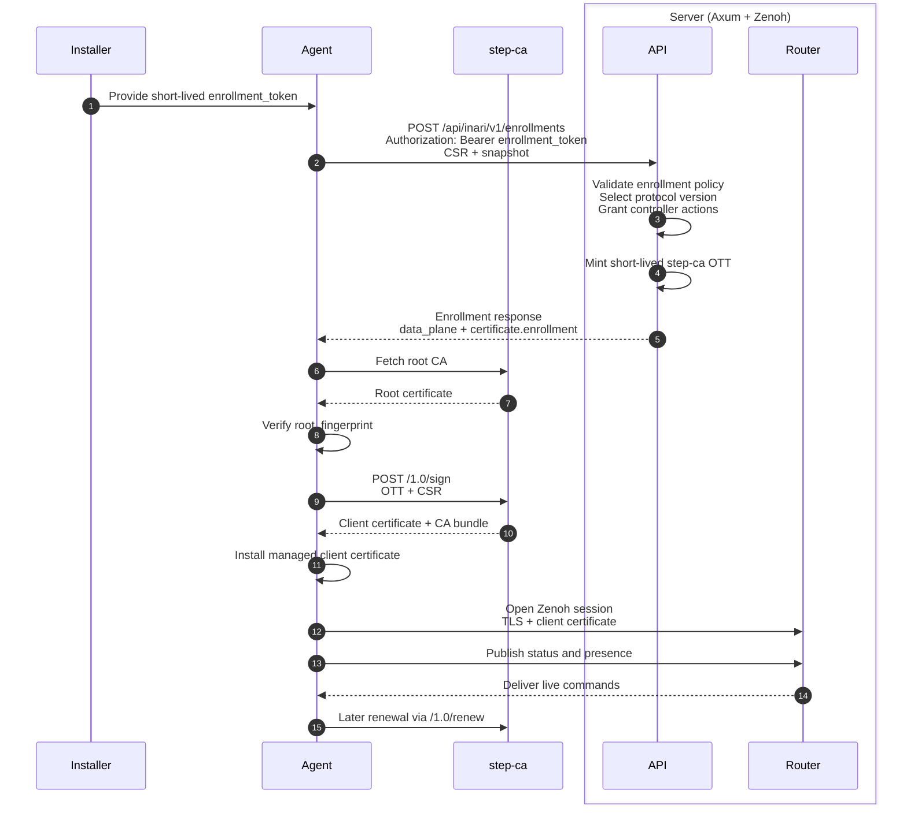

# Gateway Protocol

This document defines the managed-mode protocol boundary between:

- the local `inari` process acting as the edge gateway
- an external controller service

The current protocol uses:

- outbound `HTTPS` for enrollment
- outbound `Zenoh` for the steady-state managed data plane

Use this together with:

- [managed_gateway_stacks.md](./managed_gateway_stacks.md)
- [packages/agent/inari/gateway/protocol.py](../packages/agent/inari/gateway/protocol.py)

## 1. Document Status

- Protocol status: `draft`
- Protocol version: `2026-07-12`
- Agent role: protocol client
- Controller role: protocol server

This document describes the contract implemented by the current codebase. A few future-facing areas remain intentionally open, especially:

- lighter long-lived status documents instead of repeated full snapshots
- large-payload `content_ref` handling
- controller-side durable receipts for agent publications

## 2. Normative Language

The key words `MUST`, `MUST NOT`, `SHOULD`, `SHOULD NOT`, and `MAY` in this document are to be interpreted as described in [RFC 2119](https://www.rfc-editor.org/rfc/rfc2119) and [RFC 8174](https://www.rfc-editor.org/rfc/rfc8174).

## 3. Goals

This protocol covers:

- managed enrollment
- short-lived controller-issued `enrollment_token` bootstrap
- controller-authorized command execution
- controller-issued certificate enrollment material for managed client certificates
- Zenoh-based status publication, command delivery, and runtime event publication
- reconnect and command-history recovery
- protocol version selection

This protocol does not cover:

- local hardware drivers such as Windows spooler, USB, serial, or raw ESC/POS transport
- the agent’s local HTTP and local WebSocket APIs for desktop clients
- multi-controller coordination for one agent identity

## 4. Design Principles

1. The agent always connects outward.
2. Enrollment and the long-lived data plane are separate concerns.
3. The wire contract must not depend on internal REST request bodies.
4. Stable identifiers are preferred over user-facing names.
5. Reliability must survive reconnects and duplicate delivery.
6. After a managed client certificate has been issued, the recommended production posture is mTLS-required data-plane connectivity.

## 5. Terminology

`agent`
: The local `inari` process acting as the managed edge gateway.

`controller`
: The external service coordinating one or more managed agents.

`enrollment_token`
: A short-lived controller-issued bearer credential used only for the initial enrollment call.

`message_id`
: The transport-level identifier for one agent publication.

`command_id`
: The idempotency key for one controller command.

`sequence`
: A per-agent controller command cursor used for replay and resume.

`namespace`
: The Zenoh keyspace root assigned to one managed agent, for example `iot/v1/agents/agt_123`.

## 6. Trust And Identity

Managed mode uses an outbound trust model:

1. The agent validates the controller TLS certificate during enrollment.
2. The controller validates the agent’s enrollment credential during enrollment.
3. The controller may return provider-specific enrollment material for a managed client certificate.
4. The steady-state Zenoh data plane uses TLS with client-certificate authentication.

The agent has a persistent logical identity consisting of:

- `agent_id`
- `key_id`
- `public_jwk`
- `csr_pem`
- optional `certificate_pem`

### 6.1 Identity Binding Rules

The controller MUST enforce these bindings:

- `csr_pem` public key MUST match `public_jwk`
- any issued client certificate MUST match the CSR public key
- the agent certificate identity MUST bind to `agent_id`
- if `authorized_sans` are supplied, the issued certificate MUST NOT contain SANs outside that set

The Rust controller verifies the Ed25519 JWK, RFC 7638 thumbprint, PKCS#10 signature, CSR subject key, and any supplied certificate as one identity before it consumes an enrollment credential.

## 7. Protocol Version Selection

The controller MUST explicitly select a protocol version during enrollment.

The agent advertises:

- `protocol.version`
- `protocol.supported_versions`

The controller responds with:

- `selected_protocol_version`

The selected version MUST be one of the versions advertised by the agent. If there is no mutually supported version, the controller MUST reject enrollment and the agent MUST NOT continue to managed operation.

## 8. Enrollment

### 8.0 Invitation Bootstrap

Operators create, list, and revoke invitations through authenticated Leptos server functions. These operations are not public REST endpoints. Human access uses an OIDC Authorization Code flow with PKCE, state, and nonce; the resulting opaque controller session is held in a Secure, HttpOnly cookie and authorized with typed roles.

The setup link has this shape:

```text
https://controller.example.com/setup/{invitation_id}#code=INR-...
```

The fragment is never sent in an HTTP request. The server renders an inert setup page during SSR; hydrated Rust reads the fragment, validates it, and creates the equivalent `inari://enroll?...#code=...` deep link without authored JavaScript.

An agent may inspect non-secret invitation metadata before enrollment:

```http
GET /api/inari/v1/invitations/{invitation_id}
```

The preview contains the invitation identifier and state, expiry, controller identity, supported protocol versions, and certificate posture. It never contains a credential digest or fragment secret. The invitation credential is supplied as the bearer token to `POST /api/inari/v1/enrollments` and can be consumed only once.

### 8.1 Request

The standard enrollment request is:

```http
POST /api/inari/v1/enrollments
Authorization: Bearer <enrollment-token>
Content-Type: application/json
```

The `Authorization` header is required by the Rust controller. The credential is either a configured enrollment token or the one-use invitation code.

All `/api/**` failures use [RFC 9457](https://www.rfc-editor.org/rfc/rfc9457) problem details with `Content-Type: application/problem+json`. The API router owns its own JSON fallback; Leptos routes and static-file fallbacks never handle API paths. Private Leptos server functions are mounted under `/_server/inari`, outside the public API namespace.

Request body:

```json
{
  "protocol": {
    "version": "2026-07-12",
    "supported_versions": ["2026-07-12"]
  },
  "agent_id": "agt_123",
  "key_id": "kid_123",
  "public_jwk": {
    "kty": "OKP",
    "crv": "Ed25519",
    "alg": "EdDSA",
    "use": "sig",
    "kid": "kid_123",
    "x": "..."
  },
  "certificate_pem": null,
  "csr_pem": "-----BEGIN CERTIFICATE REQUEST-----\n...\n-----END CERTIFICATE REQUEST-----\n",
  "snapshot": {
    "...": "GatewaySnapshotPayload"
  }
}
```

### 8.2 Request Rules

- `agent_id`, `key_id`, `public_jwk`, and `csr_pem` are required
- `certificate_pem` is optional and represents the currently installed managed client certificate, if any
- the request snapshot is advisory state, not a source of granted permissions
- request-side capabilities describe what the agent supports, not what the controller has already granted

### 8.3 Response

The recommended enrollment response shape is:

```json
{
  "selected_protocol_version": "2026-07-12",
  "controller": {
    "name": "Acme IoT Controller",
    "instance_id": "controller-01"
  },
  "permissions": {
    "controller_actions": [
      "system:read",
      "devices:read",
      "events:read",
      "jobs:create",
      "jobs:cancel",
      "commands:execute"
    ]
  },
  "data_plane": {
    "kind": "zenoh",
    "session_mode": "client",
    "connect_endpoints": [
      "tls/router1.example.com:7447",
      "tls/router2.example.com:7447"
    ],
    "namespace": "iot/v1/agents/agt_123",
    "serialization": "json",
    "auth": {
      "kind": "mtls"
    },
    "tls": {
      "close_link_on_expiration": true
    }
  },
  "certificate": {
    "mode": "step_ca",
    "enrollment": {
      "base_url": "https://ca.example.com",
      "trust": {
        "root_fingerprint": "0123456789abcdef0123456789abcdef0123456789abcdef0123456789abcdef"
      },
      "bootstrap_auth": {
        "type": "ott",
        "token": "step-ca-one-time-token"
      },
      "subject": "agt_123",
      "authorized_sans": ["urn:inari:agt_123"],
      "requires_mutual_tls_after_issuance": true
    }
  },
  "enrolled_at": "2026-07-11T10:00:02Z"
}
```

### 8.4 Response Rules

- `selected_protocol_version` is required
- `permissions.controller_actions` defines what the controller is allowed to ask the agent to do
- `data_plane.kind` MUST be `zenoh`
- `data_plane.connect_endpoints` and `data_plane.namespace` are required unless a local override is explicitly configured
- `certificate` is optional
- `certificate` is a discriminated object by `mode`
- for `mode = "controller"`, `client_certificate_pem` is required and `ca_certificate_pem` is optional
- for `mode = "step_ca"`, `enrollment` is required
- `certificate.enrollment.bootstrap_auth.token` is bootstrap-only secret material; the agent stores it in the local secret store and MUST NOT persist it in enrollment metadata

### 8.5 Enrollment Sequence With step-ca Enabled



The key transition is:

- bootstrap happens over `HTTPS` before a client certificate exists
- steady-state data-plane traffic happens over Zenoh using the issued client certificate

## 9. Zenoh Data Plane

### 9.1 Session Model

The agent opens one Zenoh session in `client` mode to one or more configured routers.

The current implementation uses:

- TLS transport
- client certificates for authentication
- JSON payload serialization
- Zenoh liveliness for presence
- Zenoh query/reply for command-history recovery

### 9.2 Keyspace

Within the agent namespace, the protocol uses these keys:

| Purpose | Key |
|---|---|
| Presence | `{namespace}/presence/agent` |
| Latest status snapshot | `{namespace}/status/latest` |
| Live controller commands | `{namespace}/commands/live/{command_id}` |
| Command history query root | `{namespace}/commands/history` |
| Accepted command results | `{namespace}/results/{command_id}` |
| Runtime events | `{namespace}/events/{message_id}` |
| Agent errors | `{namespace}/errors/{message_id}` |

For an agent with namespace `iot/v1/agents/agt_123`, that becomes:

- `iot/v1/agents/agt_123/presence/agent`
- `iot/v1/agents/agt_123/status/latest`
- `iot/v1/agents/agt_123/commands/live/cmd_456`
- `iot/v1/agents/agt_123/commands/history`
- `iot/v1/agents/agt_123/results/cmd_456`
- `iot/v1/agents/agt_123/events/gevt_789`

### 9.3 Presence

The agent SHOULD maintain a Zenoh liveliness token at `{namespace}/presence/agent`.

Presence is advisory. It is not a substitute for application-level command recovery.

### 9.4 Status Publication

The agent periodically publishes an `agent.status.snapshot` document to `{namespace}/status/latest`.

The current implementation publishes the full `GatewaySnapshotPayload`. A future revision MAY introduce a lighter status document, but the key and publication semantics remain the same.

The controller records these publications and exposes the latest observed
snapshot as a stable, typed HTTP resource:

```http
GET /api/inari/v1/agents/{agent_id}/status
Authorization: Bearer <read-api-token>
Accept: application/json
```

This endpoint reads the controller's durable observation and therefore remains
available when the agent is temporarily offline. It returns the agent ID,
publication message ID, controller receipt time, and the typed gateway snapshot.
Unknown agents and agents with no observed status return RFC 9457 problem
details.

When the optional Zenoh compatibility surface is enabled, the underlying
keyspace remains directly accessible without another wrapper:

```http
GET /api/zenoh/v1/iot/v1/agents/{agent_id}/status/latest
```

### 9.5 Live Commands

The controller publishes live commands to `{namespace}/commands/live/{command_id}`.

Commands MUST carry:

- `message_id`
- `command_id`
- `sequence`

The agent subscribes to `{namespace}/commands/live/**` and dispatches commands as they arrive.

### 9.6 History Recovery

On reconnect, the agent queries:

```text
{namespace}/commands/history?from_sequence=<last_applied_controller_sequence + 1>
```

The controller returns the ordered list of commands whose `sequence` is greater than the agent’s last applied sequence.

This recovery path is required. Live delivery alone is not sufficient.

### 9.7 Agent Publications

The agent publishes these message types to the data plane:

- `agent.status.snapshot`
- `agent.command.accepted`
- `agent.command.rejected`
- `agent.runtime.event`
- `agent.error`

The current implementation persists outbound publications locally and clears them after a successful Zenoh publish. Controller-side durable receipts are reserved for a future revision.

## 10. Commands

### 10.1 Submit Print Job

```json
{
  "type": "controller.command.submit_print_job",
  "message_id": "msg_100",
  "command_id": "cmd_100",
  "sequence": 105,
  "issued_at": "2026-07-11T10:05:00Z",
  "payload": {
    "content": {
      "kind": "text",
      "text": "Hello printer",
      "document_name": "Greeting"
    },
    "target": {
      "device_id": "dev_123",
      "printer_name": "Kitchen Printer"
    },
    "options": {
      "transport": "text",
      "open_cash_drawer": false
    },
    "metadata": {
      "source": "controller"
    }
  }
}
```

### 10.2 Execute Device Command

```json
{
  "type": "controller.command.execute_device_command",
  "message_id": "msg_101",
  "command_id": "cmd_101",
  "sequence": 106,
  "issued_at": "2026-07-11T10:06:00Z",
  "payload": {
    "target": {
      "device_id": "dev_123",
      "printer_name": "Kitchen Printer"
    },
    "command": {
      "kind": "cut_paper",
      "mode": "partial"
    },
    "metadata": {
      "source": "controller"
    }
  }
}
```

### 10.3 Cancel Job

```json
{
  "type": "controller.command.cancel_job",
  "message_id": "msg_102",
  "command_id": "cmd_102",
  "sequence": 107,
  "issued_at": "2026-07-11T10:07:00Z",
  "job_id": "job_123"
}
```

### 10.4 Targeting Rules

The controller SHOULD prefer `device_id` over `printer_name`.

`printer_name` MAY remain as a convenience fallback for manually-authored or diagnostic commands, but it SHOULD NOT be the primary identifier for durable automation.

## 11. Reliability Model

### 11.1 Controller To Agent

- `command_id` is the idempotency key
- `sequence` is the replay cursor
- the agent MUST persist enough local state to reject duplicate commands and resume after reconnect

### 11.2 Agent To Controller

- `message_id` identifies one publication
- the agent persists publications locally before publish
- the current implementation treats successful Zenoh publish as sufficient to clear the local outbox

### 11.3 Resume Rules

On reconnect:

1. the agent loads `last_applied_controller_sequence`
2. the agent queries command history from the next sequence
3. the agent applies recovered commands in order
4. the agent resumes the live command subscription

## 12. Certificates And mTLS

Certificate-related data lives under the `certificate` object in the enrollment response.

The object is intentionally discriminated by `mode`. The agent must receive either controller-installed certificate material or provider-specific enrollment material. Mixed optional payloads are invalid.

### 12.1 Modes

`certificate.mode` SHOULD be one of:

- `none`
- `controller`
- `step_ca`

`controller` mode shape:

```json
{
  "mode": "controller",
  "client_certificate_pem": "-----BEGIN CERTIFICATE-----\n...\n-----END CERTIFICATE-----\n",
  "ca_certificate_pem": "-----BEGIN CERTIFICATE-----\n...\n-----END CERTIFICATE-----\n"
}
```

`step_ca` mode shape:

```json
{
  "mode": "step_ca",
  "enrollment": {
    "base_url": "https://ca.example.com",
    "trust": {
      "root_fingerprint": "0123456789abcdef0123456789abcdef0123456789abcdef0123456789abcdef"
    },
    "bootstrap_auth": {
      "type": "ott",
      "token": "short-lived-agent-scoped-token"
    },
    "subject": "agt_123",
    "authorized_sans": ["urn:inari:agt_123"],
    "requires_mutual_tls_after_issuance": true
  }
}
```

### 12.2 step-ca Rules

For `step_ca` mode:

- `root_fingerprint` MUST be `SHA-256` lowercase hexadecimal without separators
- the agent MUST verify the fetched root against that fingerprint
- the agent MUST use its CSR when requesting the first certificate
- the resulting certificate MUST match the CSR public key
- the provider derives step-ca endpoints from `enrollment.base_url`
- controllers SHOULD NOT send step-ca wire endpoints in the protocol payload
- the agent SHOULD renew through the provider's renewal flow
- the OTT SHOULD be short-lived, single-use, and agent-scoped

### 12.3 Recommended Production Posture

For managed deployments using step-ca:

- initial enrollment MAY complete before a client certificate exists
- after a managed client certificate has been issued, production deployments SHOULD require mTLS on the Zenoh data plane
- keeping mTLS optional after certificate issuance is an explicit deployment choice, not the recommended production default

## 13. Permissions

The controller permission model is:

- `system:read`
- `devices:read`
- `events:read`
- `jobs:create`
- `jobs:cancel`
- `commands:execute`

These permissions constrain what the controller is allowed to ask the agent to do. They are not request-side granted state in the enrollment snapshot.

## 14. Large Payload Handling

Inline payloads are acceptable for:

- text
- small receipts
- small device commands

For larger content such as PDF, HTML, or large images, the protocol SHOULD introduce `content_ref` so the data plane remains responsive and replay remains manageable.

## 15. Deployment Notes

The Rust controller is built with `cargo leptos build --release`. Deploy the server binary together with the generated `target/site` directory and set `LEPTOS_SITE_ROOT` to its deployed location. The generated wasm-bindgen JavaScript is a build artifact; the application contains no authored JavaScript.

Managed-gateway state is stored in externally operated PostgreSQL. Forward-only SeaORM migrations are embedded through the dedicated `inari-migration` crate and applied by `inari-server database migrate` before a Kubernetes rollout; `inari-server database status` verifies that replicas will start against a current schema. Development may opt into startup migration. Transactions, row locks, advisory locks, and uniqueness constraints protect invitation consumption, competing workers, and protocol idempotency across controller replicas.

### 15.1 Controller HTTP Edge

The enrollment endpoint SHOULD use `HTTPS`. A controller may place Axum behind a traditional HTTP edge such as Caddy for this enrollment surface.

### 15.2 Zenoh Routers

The recommended production shape is:

- HTTP enrollment handled by the controller
- a separately operated Zenoh router StatefulSet handling the managed data plane
- agent sessions in Zenoh `client` mode
- TLS with client certificates on the Zenoh transport

### 15.3 Bootstrap URL

If the normal managed data plane requires mTLS, the deployment SHOULD expose an enrollment path that remains reachable before the first managed client certificate has been issued.

## 16. Controller Compatibility Checklist

A controller is compatible with this draft if it:

1. exposes the enrollment endpoint
2. validates the `enrollment_token` or clearly documents delegated enrollment auth
3. explicitly selects a protocol version
4. returns a Zenoh `data_plane` block with stable endpoints and namespace
5. returns controller permissions
6. if using `step_ca`, returns provider-specific certificate enrollment data rather than requiring a shared CA-authorizing secret on the agent
7. publishes live commands with unique `command_id` and monotonically increasing `sequence`
8. answers command-history queries for reconnect recovery
9. consumes agent status, results, runtime events, and errors from the documented keyspace

## 17. Implementation Notes

The current codebase implements the core contract in this document, including:

- HTTPS enrollment with `enrollment_token` in `inari-server`
- explicit `selected_protocol_version`
- nested enrollment `permissions`, `data_plane`, and `certificate` structures
- Zenoh-backed status publication, per-command live delivery, and history recovery
- protocol-native command payload models
- explicit controller-action permissions
- managed step-ca certificate lifecycle supervision
- controller-side command state and agent publication ingestion

Future work remains around:

- standardized controller-side durable receipts for agent publications
- lighter steady-state status documents
- `content_ref` for large payloads
