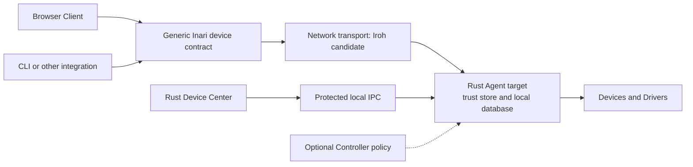
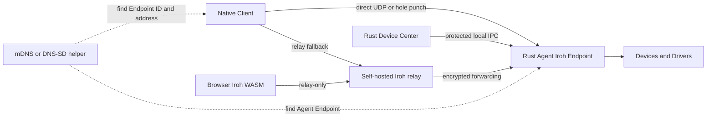

# Pairing and SDK technologies for Inari

> Supporting research. The [connectivity reference](connectivity/README.md)
> defines the consolidated target. Follow its requirements and implementation
> stages. Candidate rankings and rollout orders here are historical evidence.

**Checked:** 2026-10-08

This note covers discovery, pairing, contracts, key storage, diagnostics, and
local durability. It assumes that the Agent can operate without a Controller.
It also assumes that several generic integrations can use one Agent at the
same time.

The user specified the target architecture after the initial research:
Device Center communicates with the Agent through local IPC, with iceoryx2 or
a similar library. The Agent will move from Python to Rust. Python remains a
supported integration language. Current Python and HTTP details in this note
describe implementation evidence or the transition, not the target core.

## Decision

Use this small stack:

| Choice | Role | Current state | Extra service |
| --- | --- | --- | --- |
| interprocess, Tokio, and Tonic/Protobuf | Device Center to Agent communication | Preferred Rust target after the [local IPC audit](local-ipc-alternatives-research.md). Platform trial remains required. | None |
| FastAPI, Pydantic, OpenAPI, and Progenitor | Shared contract and SDK tools | Dependencies already present. Generic contracts still need changes. | None |
| Agent-owned pairing, Ed25519, keyring, QR, and SQLite | Identity, grants, revocation, and restart state | Building blocks already present. Generic pairing remains a proposal. | None |
| Iroh | Native peer transport for the Agent and native clients | New transport candidate | Production relays. Address lookup for changing remote endpoints. |
| mDNS and DNS-SD | Local Agent discovery | New optional helper | None on a local link |
| Magic Wormhole | Remote first pairing with a short code | Optional new helper | Mailbox server, plus transit relay when direct transfer fails |

Use shared domain contracts across IPC and network adapters. The current JSON
and HTTP tooling is useful implementation evidence. Rust migration needs a
deliberate contract and encoding decision. It does not require an HTTP-based
Device Center. Telemetry export remains optional.

## Pairing and transports are separate concerns

Pairing is Inari's approval workflow. It associates a proved client identity
with an Agent and creates bounded Client Grants. Iroh establishes encrypted
connections and authenticates transport peer identities. An authenticated peer
still needs Inari permission to use a Device. Pairing can run over a restricted
Iroh protocol without creating a separate pairing service. [Iroh connection
hooks](https://docs.iroh.computer/connecting/endpoint-hooks).

Device Center uses a protected local IPC principal. Installation and OS access
policy establish its local access. It does not need the external QR pairing
flow. The Agent still checks administrative permissions before approval,
revocation, or service actions.

## Local IPC and the planned Rust Agent

The target separates two transport boundaries:

- Device Center and authenticated local CLI: protected local IPC.
- External application clients: Iroh or another supported network interface.

The Rust Agent uses Iroh's native crate. External Python clients can use its
official bindings. A Python Agent bridge is transitional.

Iceoryx2 has a Rust core, Python bindings, request-response, publish-subscribe,
and event support. It is a local IPC candidate. Its current support table
lists desktop platforms at tier 2, with restricted safety and security
features. [Official repository](https://github.com/eclipse-iceoryx/iceoryx2).

Its current FAQ reports that service access across different OS users is not
implemented. It explicitly rejects `dev_permissions` for production. A system
service and a desktop app commonly run under different accounts. Validate
that exact deployment before choosing iceoryx2. Do not make shared resources
globally accessible to bypass this boundary. [Multiple-user limitation](https://github.com/eclipse-iceoryx/iceoryx2/blob/main/FAQ.md#accessing-services-from-multiple-users).

Named pipes on Windows and Unix domain sockets on Unix are other local IPC
options. Their access policy still needs an Inari design. The Rust
`interprocess` library provides a cross-platform local socket interface.
[Interprocess](https://github.com/kotauskas/interprocess),
[Windows named-pipe access control](https://learn.microsoft.com/en-us/windows/win32/ipc/named-pipe-security-and-access-rights).

Keep one domain model with separate IPC and network encodings. Shared memory
requires compatible layouts and self-contained messages. Ordinary Rust
`String`, `Vec`, and pointer-bearing domain objects are not automatically
safe IPC messages. Use bounded shared-memory types or encoded bytes at the
IPC boundary. The queue, grants, and physical execution evidence remain in
the Agent. [Iceoryx2 data-type requirements](https://github.com/eclipse-iceoryx/iceoryx2/blob/main/FAQ.md#how-to-define-custom-data-types).

## Client and Agent

A **Client** is a browser, Device Center, CLI, or application integration. It
holds a client identity. It requests Device Work and reads Device Health and
events.

The **Agent** is the long-running service on an Agent Host. It owns Devices,
Drivers, the local work queue, the local trust store, and the local database.
The Client never talks to a Driver directly. The SDK is a library inside the
Client, not another service that the operator must install.

Device Center is a local Client for approval and support. The Agent continues
after Device Center closes. One Agent can serve several independent Clients
and control several Devices.

The transport changes the path. It does not change Device Work semantics.
The Agent enforces permissions for the authenticated principal on each path.
Local administration and external Client Grants can use different credentials.

## Iroh deployment

Use one persistent Iroh Endpoint for each Agent. Store its secret key in the
existing protected secret store. Iroh creates a new random key when the builder
does not receive a secret key. Without a saved key, a restart creates a new
Endpoint ID. The [Iroh endpoint source](https://github.com/n0-computer/iroh/blob/main/iroh/src/endpoint.rs)
documents this behavior.

Use managed or self-hosted relays for production. Iroh public relays are shared,
rate limited, have no SLA, and expose connection metadata. The [public relay
policy](https://docs.iroh.computer/iroh-services/relays/public) recommends
managed relays for production. A relay forwards encrypted traffic. It does not
grant access to an Agent or a Device.

Iroh browser builds cannot send UDP from the browser sandbox. Browser traffic
therefore uses a relay. The [browser documentation](https://docs.iroh.computer/languages/wasm-browser)
also says that Iroh does not publish an npm WASM package. A browser can use a
small application wrapper, or it can use the existing local HTTPS interface.
Chrome gates requests from a public origin to local addresses behind Local
Network Access permission. The [Chrome guidance](https://github.com/GoogleChrome/modern-web-guidance/blob/main/skills/modern-web-guidance/guides/security/local-network-access.md)
requires a secure context for this path.

Local HTTPS also needs certificate trust, origin policy, and client
authentication. Local network permission alone does not complete that path.

The Python binding is a practical bridge during the Agent transition and for
future Python clients. The Rust Agent uses the native crate. The [official FFI
repository](https://github.com/n0-computer/iroh-ffi) mirrors the stabilized Iroh
1.0 endpoint surface. Its [Python package metadata](https://github.com/n0-computer/iroh-ffi/blob/main/pyproject.toml)
still marks the package as Alpha. The [Python wheel list](https://github.com/n0-computer/iroh-ffi/blob/main/README.python.md)
currently covers Windows x86-64, Linux glibc x86-64 and ARM64, and macOS ARM64.
Package tests must cover the remaining Inari target matrix.

Iroh Endpoint IDs and tickets identify a transport endpoint. They do not carry
an Inari Client Grant. The [ticket project](https://github.com/n0-computer/iroh-tickets)
describes a ticket as a serializable endpoint address. Inari must wrap any
ticket in an Agent-owned, short-lived Pairing Request with a consumed state.

After pairing, the SDK remembers the Agent's Endpoint ID. It refreshes dialing
information through configured address lookup or current peer hints. The
[address lookup documentation](https://docs.iroh.computer/concepts/address-lookup)
describes signed Pkarr records and DNS or HTTPS resolution. This avoids another
pairing merely because an Agent changes networks. Endpoint lookup does not
grant access, but its availability and metadata privacy need production
configuration alongside the relays.

Unknown peers can use only a bounded pairing path during an active Pairing
Request. Normal Device Work requires approved Client Grants. A peer admission
hook must not grant device access merely because a pairing connection succeeds.

## Pairing experience

The default flow has no Controller account, manually entered IP address,
certificate upload, or Odoo company field. The target is one access approval
per client installation or persistent browser profile. Short-lived operator
permissions remain distinct from this saved Client Pairing.

| Client location | Proposed operator flow |
| --- | --- |
| Same Agent Host | Select **Connect Inari**. A registered app link opens Device Center with the Pairing Request. Approve the requested access. |
| Another computer nearby | Native discovery lists possible Agents. Select one, or scan a QR invitation from Device Center. Approve its Pairing Request. |
| Remote or headless server | An authorized person creates an invitation on the Agent Host. The remote Client imports the link or optional short code. Approve the resulting Pairing Request locally. |

A browser does not discover local Agents through mDNS. It uses an explicit
link or a native companion. A headless Agent uses an authenticated local CLI
for approval. It does not need Device Center or a new Controller service.

The invitation binds the target Agent identity, expiry, and random pairing
nonce. The Client proves possession of its proposed key. The Agent binds that
key to the requested access and stores the approved Client Grants. A displayed
application name alone does not prove identity. A comparison code can bind the
two visible screens when the bootstrap channel does not establish that trust.

The SDK handles key creation, saved identity, address lookup, reconnect, and
Job Reconciliation. A network change does not require another Pairing Request.
Grant expiry, revocation, or lost identity requires renewed authorization.

Inari enforces expiry and single use for its Pairing Request. An Iroh ticket
alone is reusable and can become stale. The [ticket documentation](https://docs.iroh.computer/concepts/tickets)
makes both limits explicit.

Measure manual fields, access approvals, time to the first Device Test, and
unexpected requests to pair again. This research gives no measured result.

## Local discovery with mDNS and DNS-SD

Use standard DNS-SD for product discovery. RFC 6763 defines PTR browsing, SRV
resolution, and TXT key-value data. RFC 6762 limits `.local` mDNS to the local
link. See the [DNS-SD specification](https://www.rfc-editor.org/rfc/rfc6763.html)
and the [mDNS specification](https://www.rfc-editor.org/rfc/rfc6762.html).

Advertise one service such as `_inari-agent._tcp.local.`. Include only public
bootstrap data in TXT records:

- Agent ID and a short public-key fingerprint
- contract major and protocol major
- HTTPS port or Iroh Endpoint ID
- a flag that says that pairing is required

Do not publish pairing secrets, private keys, bearer credentials, or Device Work
data. DNS-SD has no Agent authorization model. The RFC says that authenticity
depends on DNS security mechanisms. Inari must still use a Pairing Request and a
proof of client-key possession after discovery. This proof must not require an
Odoo Pairing Assertion or a shared integration issuer.

Two maintained implementations fit the current runtime. [`mdns-sd`](https://github.com/keepsimple1/mdns-sd)
is a Rust implementation for macOS, Linux, and Windows. It supports responder
and browser use without selecting an async runtime. [`python-zeroconf`](https://github.com/python-zeroconf/python-zeroconf)
is a pure Python implementation with service browsing and registration. The
project README reports an LGPL-2.1-or-later license. Record that source fact
before adding it to a distributed Agent package.

Iroh also provides two optional mDNS address lookup crates. The [Iroh mDNS
guide](https://docs.iroh.computer/connecting/local-address-lookup) says that
`iroh-mdns-address-lookup` and `iroh-mdns-peer-lookup` use different discovery
formats. Select one format for Iroh peer lookup. Keep product discovery
separate. The documented Iroh Python binding does not list these optional Rust
lookup crates, so a Python `zeroconf` helper is the safer first integration.

Browsers need a native helper or an explicit Agent Endpoint. Iroh states that
its mDNS address lookup does not work in browsers. A browser can call a known
HTTPS address after the user grants local network access. Browser discovery is
therefore a user-interface problem around mDNS, not a reason to expose mDNS
records as authority.

## Short-code pairing with Magic Wormhole

Magic Wormhole fits remote first pairing when the user has two screens and no
shared local network. The Python API uses a short code and a mailbox server for
the PAKE exchange. The [Python API documentation](https://github.com/magic-wormhole/magic-wormhole/blob/master/docs/api.rst)
says that the mailbox server relays small encrypted messages. The [transit
protocol](https://github.com/magic-wormhole/magic-wormhole-protocols/blob/main/transit.md)
tries a direct connection, then uses a transit relay when direct transfer
fails.

The official [Rust implementation](https://github.com/magic-wormhole/magic-wormhole.rs)
is a port of the Python implementation. Its README lists missing Python
features and an EUPL-1.2-or-later license. A custom Inari message can work only
after a Python-to-Rust interop test with one fixed AppID and pinned versions.
The Rust crate documentation also explains that the Wormhole system combines a
rendezvous protocol, PAKE, and transit. Treat it as a bootstrap channel, not as
the Device Work protocol.

Use this sequence:

1. The Agent creates a short-lived Pairing Request and displays a QR code or a
   short code in Device Center.
2. The Client completes the Wormhole exchange and sends its public key and
   request details through the encrypted record pipe.
3. The Agent runs the existing challenge and Ed25519 attestation flow.
4. The Agent stores the Client Pairing and Client Grant, then consumes the
   Pairing Request.
5. The Client reconnects through Iroh or HTTPS with its durable identity.

Magic Wormhole can add two services to operate. The [mailbox server](https://github.com/magic-wormhole/magic-wormhole-mailbox-server)
queues rendezvous messages. The [transit relay](https://github.com/magic-wormhole/magic-wormhole-transit-relay)
forwards data when a direct path fails. A public service is useful for a trial.
A production deployment needs service availability and abuse controls. For
small pairing records, evaluate the encrypted mailbox channel before adding
transit. Keep QR and local pairing as the default so this service is optional.

## Shared contract and SDK boundary

The repository already has the right shape. FastAPI and Pydantic produce
[`contracts/local-agent.openapi.json`](../contracts/local-agent.openapi.json).
The Rust client consumes it through [`inari-agent-client/build.rs`](../crates/inari-agent-client/build.rs)
and Progenitor. The Device Center README states that generated models stay
behind a curated Rust client boundary. The event stream has a separate
[`contracts/local-agent.events.json`](../contracts/local-agent.events.json)
contract.

Reuse the contract models across transports. Define one generic operation
model for Device Work, Device Capability, Device Health, Client Pairing, and
Client Grant. Keep integration-specific references in opaque metadata. Do not
put Odoo fields in the generic contract.

OpenAPI is a language-neutral HTTP description. The [official specification](https://spec.openapis.org/oas/v3.1)
also describes code generation and testing uses. Progenitor generates HTTP
client code. It does not generate the framing or client code for a custom Iroh
stream. Keep the Iroh protocol adapter hand-written and reuse the same domain
models and authorization service.

For the planned Rust Agent, the [local IPC audit](local-ipc-alternatives-research.md)
recommends Tonic and Protobuf above protected local streams. This choice supplies
typed event streams and a language-neutral schema. It does not depend on a
measured JSON performance problem. The [official Protobuf overview](https://protobuf.dev/overview/)
describes generated messages. Select one authoritative domain schema during the
Rust redesign. Do not keep independently maintained OpenAPI and Protobuf domain
models merely to preserve the current implementation.

## Keys, durability, and diagnostics

The repository already depends on Python `keyring`, Rust `keyring`, Ed25519,
`cryptography`, SQLAlchemy, Alembic, SQLite, and QR generation. The Agent local
trust store uses the protected secret store, backed by the keyring where that
store is available. Device Center stores its client identity in the OS
credential store. The [Python keyring project](https://github.com/jaraco/keyring)
and [Rust keyring project](https://github.com/open-source-cooperative/keyring-rs)
both document native credential stores for the supported desktop systems.

Store the Iroh Agent key in this existing protected store. Store only its public
Endpoint ID, protocol versions, relay choice, and last path in local metadata.
Keep the Agent signing key and transport key separate unless a later design
proves that one key has a clear rotation policy. Never put private key material
in a QR code, mDNS record, ticket log, or Diagnostics Bundle.

Persist these records locally:

- Agent transport identity and key version
- Client public key, transport peer ID, optional browser origin, Client Grants, expiry, and
  revocation state
- Pairing Request hash, expiry, and consumed state
- last direct or relay path and protocol or contract versions
- Device Work, event sequence, and replay cursor

The Agent already stores Devices, jobs, attempts, events, and gateway sequence
state in SQLite with Alembic migrations. Keep the transport metadata beside
that state when it needs relational queries. The existing keyring-backed trust
state is enough for a small number of clients. Invalidating pending requests on
restart is safer than restoring a live short code. Persist only a hash and its
expiry when restart-safe bootstrap is required.

Use the existing Python logging and Rust `tracing` stack for the first
Diagnostics Bundle. Rust [`tracing`](https://docs.rs/tracing/latest/tracing/)
supports structured event fields. Include
Agent ID, Endpoint ID, client fingerprint, transport, direct or relay path,
protocol major, contract major, last handshake result, and event sequence. Do
not include Device Work content, pairing secrets, tokens, or private keys. Iroh
hooks can expose connection and path events for these fields. The [Iroh hook
guide](https://docs.iroh.computer/connecting/endpoint-hooks) documents both
peer rejection and path observation.

OpenTelemetry can become an export option later. Its [status table](https://opentelemetry.io/status/)
marks Python traces and metrics as stable and Rust signals as Beta. Its [Python
exporter guide](https://opentelemetry.io/docs/languages/python/exporters/)
recommends a Collector for production export. That Collector is extra
infrastructure. Keep telemetry export optional and keep local diagnostics
useful without it.

## Small rollout

1. Make the device contract and Client Grants independent of Odoo. Prove two
   generic Clients on the local interface. Remove the required Controller
   setup gate from the proposed default.
2. Add an Iroh transport adapter with a persistent Agent key and a self-hosted
   relay configuration.
3. Validate protected local IPC for Device Center under the real service and
   desktop accounts. Add DNS-SD discovery for external native clients. Treat
   discovery as a hint, then prove the client key.
4. Test two generic Clients at the same time. Test grant isolation, revocation,
   restart, direct paths, relay paths, and stale Pairing Requests.
5. Add Magic Wormhole only for remote first pairing. Pin the Python and Rust
   implementations and run interop tests before shipping it.

Tailcat can use the same contract, pairing, key, discovery, and diagnostics
layers. Iroh has a native fit for the planned Rust Agent. Its official FFI
supports the transition and external Python integrations.
The supplementary stack remains independent of that transport choice.

## Other useful supplements

**PyO3 and Maturin** help when Inari needs a shared Rust module inside the
Python Agent. PyO3 exposes Rust code to Python. Maturin builds Python wheels
with PyO3, UniFFI, or CFFI bindings. This can avoid duplicate native codecs or
processing logic. Use Iroh's official FFI first. An Inari-owned native module
adds a build and support obligation. [PyO3 guide](https://pyo3.rs/),
[Maturin guide](https://www.maturin.rs/).

**TUF** supports authenticated software updates through signed metadata.
`python-tuf` is its Python reference implementation. AWS `tough` is a Rust TUF
client. Evaluate this when existing platform update mechanisms do not cover
the required unattended update path. It needs a metadata repository, release
signing, and an installer lifecycle. It does not replace those systems or
pairing trust. [Python TUF](https://github.com/theupdateframework/python-tuf),
[Rust tough](https://github.com/awslabs/tough).

**Iroh Blobs** supports verified range transfers and download resumption.
It can help with large document delivery over poor links. Its current README
states that the current branch is not production quality and points to 0.35.
The official Iroh FFI excludes Blobs, Docs, and Gossip. Treat Blobs as a later
experiment with explicit version and binding work. Keep access checks and
Device Spool retention in the Agent. Transfer completion does not prove
physical output. [Blobs guide](https://docs.iroh.computer/protocols/blobs),
[repository status](https://github.com/n0-computer/iroh-blobs),
[FFI scope](https://github.com/n0-computer/iroh-ffi).

**CRDT synchronization and gossip** do not belong in device execution
authority by default. Inari needs one Agent decision for each queue, Client
Grant, and Exclusive Device lease. Distributed synchronization can serve a
future metadata feature after that feature has a specific consistency model.

This note extends the [connection recommendation](connection-simplification-research.md)
and [transport comparison](inari-connectivity-alternatives-research.md).
All new flows are proposals. No runtime, dependency, or contract change
accompanies this research.
